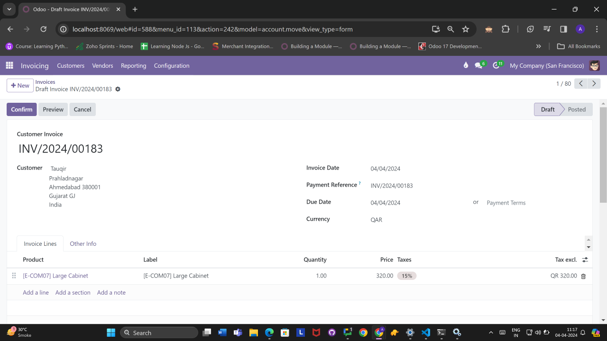

# Sadad Integration Module for Odoo (Qatar)

Overview
--------

This custom module integrates Sadad payment system with Odoo, tailored for users in Qatar (QA). It enables seamless management of invoices and payments within the Odoo platform, using Sadad's services.

Images
------

Features
--------

- Secure storage of Sadad API credentials within Odoo.
- Integration with Sadad's APIs for creating and updating invoices.
- Capture and storage of Sadad response details such as invoice number and ID within Odoo.

Installation
------------

1. Clone or download the repository into your Odoo addons directory.

2. Install the module from the Odoo Apps interface or using the command-line tool:

    ::
    
        $ odoo-bin -i odoo_sadad_qatar_integration

3. During the installation process, you will be prompted to enter Sadad API credentials. Fill in the required information to proceed.

Usage
-----

1. Once installed, navigate to the invoicing module in Odoo.
2. Create or edit an invoice as usual.
3. Upon saving the invoice, the module will automatically make API calls to Sadad to create or update the invoice.
4. Sadad response details such as invoice number and ID will be stored in Odoo for future reference.

Configuration
--------------

- **API Credentials:** API credentials for Sadad can be configured during module installation. To update these credentials later, go to Settings > Sadad Integration > API Credentials.

Requirements
------------

- Odoo 17.0
- Sadad API credentials

License
-------

This module is licensed under the MIT License.

Support
-------

For any issues or inquiries, please contact [].
